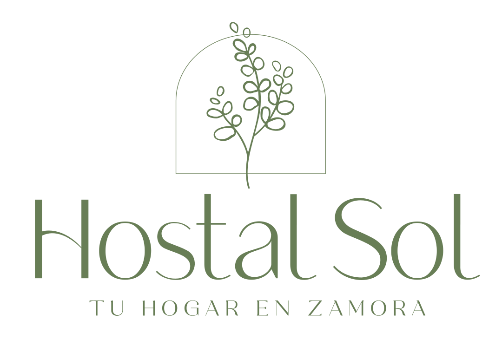

# Hostal Sol Zamora 2026



A modern, multilingual web platform for **Hostal Sol Zamora**, a boutique hostel located in the heart of the historic center of Zamora, Spain. This project is a complete redesign and technical modernization of the original site, balancing a Nordic-minimalist aesthetic with high-performance features.

## 🏨 About Hostal Sol

Hostal Sol is a family-run business with a hospitality legacy dating back to **1975**. Evolving from the original *Pensión Padornelo* into a contemporary boutique hostel, we offer a unique blend of traditional warmth and modern comfort.

## 🚀 Key Features

- **Nuxt 4 Ready**: Built using Nuxt 3 with the `future: { compatibilityVersion: 4 }` flag for long-term stability.
- **Optimized Performance**: Exclusively uses `@nuxt/image` with `<NuxtPicture>` for automatic format conversion (WebP/AVIF) and responsive resizing.
- **Multilingual Support**: Full i18n integration (Spanish & English) with browser detection and persistent preferences.
- **Interactive Room Discovery**: Build-time discovery of room media with a rich gallery supporting both photos and YouTube Shorts.
- **3D Discount Card**: An interactive 3D CSS effect to highlight direct booking benefits.
- **CI/CD Driven**: Automated deployment to GitHub Pages via GitHub Actions, including Docker-based build verification.

## 🛠 Tech Stack

- **Framework**: [Nuxt 3](https://nuxt.com/) (Vue 3, TypeScript)
- **Image Optimization**: [@nuxt/image](https://image.nuxt.com/) (IPX)
- **Icons**: [Lucide Vue Next](https://lucide.dev/)
- **Carousel**: [Vue3-Carousel](https://ismail9k.github.io/vue3-carousel/)
- **Translations**: [@nuxtjs/i18n](https://i18n.nuxtjs.org/)
- **Deployment**: GitHub Pages

## 📦 Getting Started

### Prerequisites
- Node.js 22.x or higher
- npm or pnpm

### Installation

1. Clone the repository:
   ```bash
   git clone https://github.com/JuanmanDev/HostalSolZamoraWeb2026.git
   cd HostalSolZamoraWeb2026
   ```

2. Install dependencies:
   ```bash
   npm install
   ```

3. Start the development server:
   ```bash
   npm run dev
   ```

4. Build for production:
   ```bash
   npm run generate
   ```

## 📂 Project Structure

- `app/`: Source code following the Nuxt 4 directory structure.
  - `components/`: Modular UI components and layout sections.
  - `composables/`: Reusable logic for room data and search.
  - `pages/`: Route-based views.
  - `public/`: Static assets (images, logos).
- `i18n/`: Translation files (JSON).
- `nuxt.config.ts`: Main configuration including room image discovery logic.

## 📜 History

The project honors the family's hotelier history, starting in 1975 on Calle Aire. Today, Hostal Sol represents the evolution of that vision, providing a clean, professional, and welcoming digital home for our guests.

---

*Redesigned with ❤️ for Hostal Sol Zamora.*
